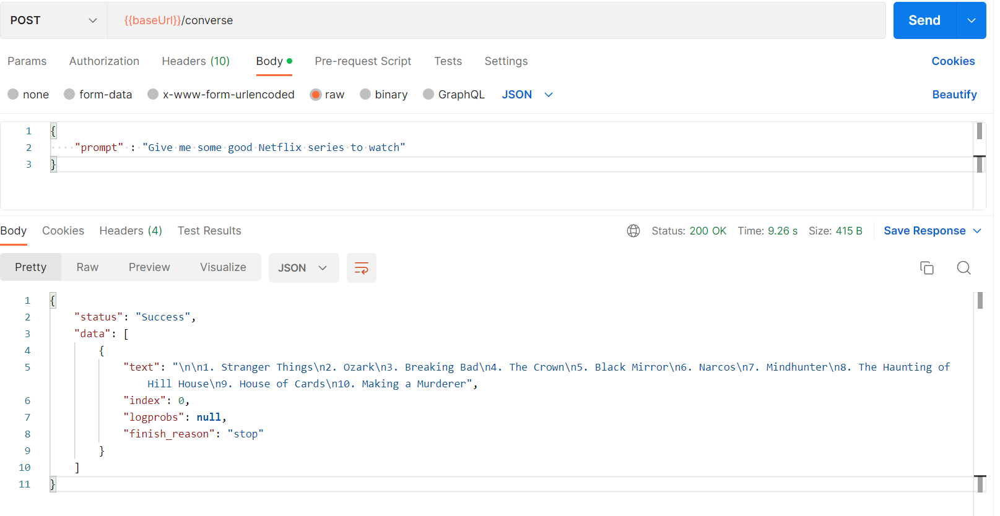

# chat-gpt-api
Serverless Go based Chat GPT API

### Local development and Testing

**Invoking function locally through local API Gateway**

Create a new Chat GPT Token from [here](https://beta.openai.com/account/api-keys)\
Update the <CHAT_GPT_TOKEN> in template.yaml
```
Environment:
    Variables:
        CHAT_GPT_TOKEN: <CHAT_GPT_TOKEN>
```

Then run below command 
```
sam build
sam local start-api
```

If the previous command ran successfully you should now be able to hit the following local endpoint to invoke your function `http://localhost:3000/converse`


## Packaging and deployment

Build the app and then deploy it to AWS
```
sam build
sam deploy --guided
```

# See it in Action

After deployment try it using postman 
